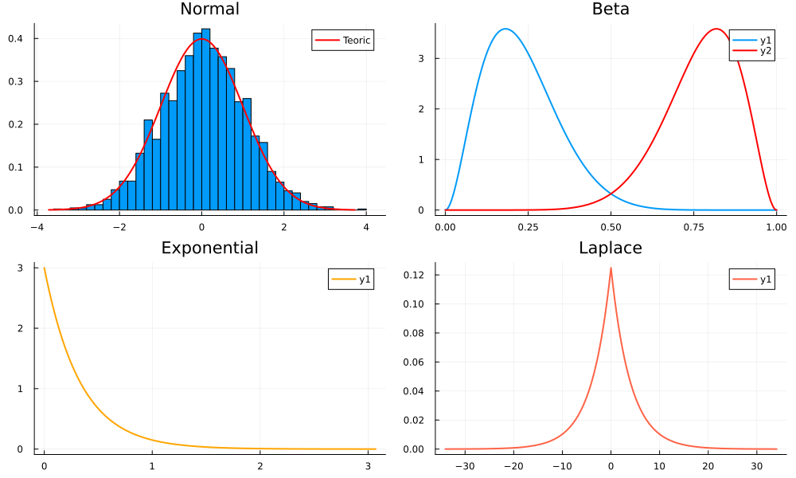
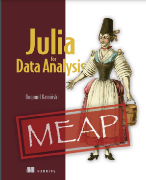
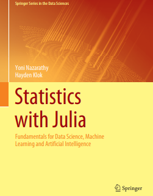

# 🤖 Programación en Julia

Algunos Scipts que he realizado para empaparme en el lenguaje [**Julia**](https://julialang.org/). 

## 🦉 Mirada

```{julia}
x = 1
x > 0 ? println("x es positiva") : println("x no es positiva")
```

|||
|--------|-------|

## 🦜Referencias 

- *Julia for Data Analysis, MEAP Edition, Bogumił Kamiński*
- *Statistics with Julia Fundamentals for Data Science, Machine Learning and Artificial Intelligence*

|  |  |
|---|---|
